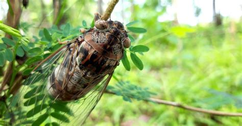

import { Image } from "astro:assets";
import cicada from "./cicada-image.jpg";

Hello and welcome to my first blog post on here!
I'm glad you got this far, as a reviewer of this blog project or just as a person that stumbled upon this on the internet. This is my blog!

<Image src={cicada} alt="Brown cicada" loading="eager"></Image>
 

<em>
  Insert the sound of chirping cicadas
</em>

Ok so you're probably a little bored because this blog is mostly just text and a little picture trying to stimulate that brain which probably has seen one or two of these so called _short videos_.😅

So I'm gonna try my best to entertain you with the content in this blog post.
To sum it up, it's me saying hi.👋

Short story long I wanted to start this blog in order to share my opinion and viewpoint online. And after I acquired some coding skills I found this template, set it up and now you're here reading this. As for the stuff that's to come, you'll get a mix of _psychology_, _tech_ and _personal topics_ here because I love to get into different topics and share my opinion about them.😝😗

Anyways, you can go about your merry day now and check out the next blog post when it launches. Should you not use an RSS reader (i'll have a blog post on how to add this blog there soon) you can also check out my X account if you wanna get notified when the next post launches. All in all, have a nice day and see you soon!😉
